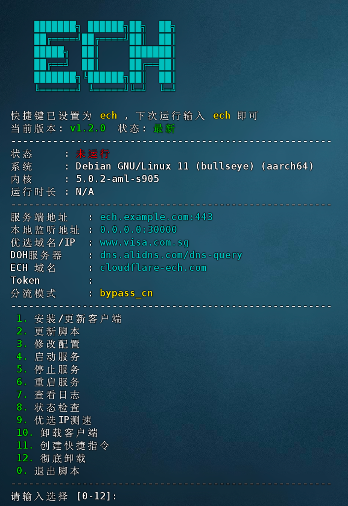

# ECH Tools

[](https://opensource.org/licenses/MIT)

> ⚠️ **说明 / Note**  
> 本项目是基于 [byJoey/ech-wk](https://github.com/byJoey/ech-wk) 开发的第三方管理脚本。  
> 核心代理程序文件 (`ech-workers`) 直接来源于原作者的 Release 发布页。  
> 感谢原作者 @byJoey 以及底层核心开发 [CF_NAT](https://t.me/CF_NAT)！

---

**打造家庭全天候 ECH 代理中心。**

这是一个专为 Debian / Ubuntu / Armbian / iStoreOS (OpenWrt) 等 Linux 系统设计的命令行管理工具 (CLI)。

原项目主要提供了 Windows 和 Mac 的图形化客户端，但在家庭网络环境中，利用 **低功耗 Linux 设备**（如 斐讯N1、树莓派、软路由、飞牛NAS 等）进行 7x24 小时部署才是更高效的选择。

通过本脚本，您可以将 Linux 设备瞬间变身为一台 **SOCKS5/HTTP 代理服务器**：
*   ✅ **广泛兼容**：支持标准 Linux (Systemd) 及 OpenWrt (Procd) 架构。
*   ✅ **局域网共享**：家庭中的手机、PC、电视均可通过局域网 IP 连接代理。
*   ✅ **远程访问**：配合 DDNS，在外网也能安全连接回家的代理节点。
*   ✅ **服务化管理**：告别繁琐的命令行参数和后台保活，一切自动化。



## ✨ 主要特性

*   **⚡️ 一键安装**: 自动检测系统架构 (amd64/arm64)，自动下载最新内核。
*   **🌐 系统适配**: 完美支持 Debian/Ubuntu (Systemd) 与 OpenWrt/iStoreOS (Procd)。
*   **🇨🇳 国内加速**: 智能检测网络环境，国内用户自动使用 `gh-proxy` 镜像加速下载。
*   **🔄 自动更新**: 脚本支持版本检测与一键自我更新，保持功能最新。
*   **🖥️ 交互界面**: 提供全中文的图形化菜单 (TUI)，操作简单直观。
*   **📊 状态检查**: 一键检测服务状态、优选IP出口、CF反代连接，并显示IP归属地。
*   **🚀 优选测速**: 内置多个优选域名，自动测速选择最优节点。
*   **🤖 自动配置**: 引导式配置向导，支持快速设置优选 IP、Token、DOH 等关键参数。
*   **⚙️ 服务管理**: 自动创建服务，支持开机自启、后台静默运行、异常自动重启。
*   **⌨️ 快捷指令**: 自动注册 `ech` 全局命令，随时随地管理服务。

---

## 📋 更新日志

### v1.3.0 (2026-01-02)

**🎉 优选域名/IP 功能大升级：**

*   **📁 子菜单管理**: 主菜单 9 现在是「优选域名/IP」入口，进入后有完整的管理子菜单：
    1. 添加自定义域名/IP
    2. 删除自定义域名/IP
    3. 查看当前列表
    4. 开始测速
*   **📝 批量操作**: 添加/删除均支持逗号分隔的批量输入（如 `1,3,5` 或 `a.com,b.com`）。
*   **🌐 IPv6 支持**: 现已完整支持 IPv6 地址测速，自动识别并使用 `ping6` 及 `curl -6`。
*   **📊 显示优化**: 结果表格加宽以适应 IPv6 地址显示。

**🛠️ 代码优化：**

*   移除在线更新逻辑，简化为纯本地 `custom_domains.txt` 管理。
*   首次运行自动初始化默认优选域名列表。
*   全局化 `CUSTOM_LIST` 变量，精简代码结构。

---

## 🌐 Worker 部署（服务端）

> **⚠️ 本项目提供了深度增强版的 `_worker.js`，除了核心代理功能，更集成了精美的可视化WEB管理面板。**

### 🎨 管理面板核心特性

*   **💎 极简美学**: 采用现代 **毛玻璃 (Glassmorphism)** 设计语言，支持 **深色/浅色模式** 自动切换与持久化。
*   **📊 请求监控**: 集成 Cloudflare API，实时显示 Workers/Pages 的当日 **请求数配额 (100k)** 使用进度。
*   **🌐 网络检测**: 内置多维网络诊断，直观查看国内/国外出口 IP，并对字节、B站、GitHub、Google 等进行 **延迟/丢包测试**。
*   **⚙️ 交互式配置**: 在网页端即可直接修改 **Token** 和 **ProxyIP**，支持自定义反代地址。
*   **📱 移动端优化**: 针对手机端进行了深度适配，操作如原生 App 般丝滑。
*   **🔒 安全加固**: 敏感操作内置非空校验，支持退出登录。
*   **⚡ KV 缓存优化**: 使用 Cache API 缓存配置，**大幅减少 KV 读取次数**（每小时仅读取一次），节省配额。

### 🛠️ 部署步骤

1.  **创建 KV 命名空间**:
    *   登录 [Cloudflare Dashboard](https://dash.cloudflare.com/)。
    *   进入侧边栏 **存储和数据库 (Storage & Databases)** → **Workers KV** → **创建命名空间**。
    *   名称可自定义（例如：`ECH_KV`），点击保存。
2.  **部署 Worker**:
    *   进入 `Workers & Pages` → `概述` → `创建` → **从 Hello World! 开始**。
    *   将本项目的 `_worker.js` 代码全部复制并覆盖到编辑器中，点击 `部署`。
3.  **绑定 KV (关键)**:
    *   在刚部署好的 Worker 页面，选择顶部的 **绑定 (Bindings)** 选项卡。
    *   点击 **添加绑定**。
    *   在左侧列表中选择 **KV 命名空间**，然后点击右下角的 **添加绑定**。
    *   在配置页面：
        *   **变量名称**: 必须填写 `KV`（大写）。
        *   **KV 命名空间**: 选择刚才创建的那个（如 `ECH_KV`）。
    *   最后点击 **添加绑定** 确认。
4.  **绑定自定义域 (推荐)**:
    *   在 Worker 页面点击顶部的 **设置** 选项卡，找到 **域和路由** 区域。
    *   点击右上角的 **添加**，选择 **自定义域**。
    *   输入您在 Cloudflare 托管的二级域名（例如：`ech.yourdomain.com`）。
    *   **重要提示**: 由于 `workers.dev` 域名在国内部分地区无法直接访问，**强烈建议**绑定自定义域名以确保管理面板和代理服务的稳定性。
5.  **自动检测与初始化**:
    *   直接访问您的 Worker 域名。
    *   **自动引导**: 系统会检测到这是首次部署，并自动跳转到 **"设置 Token"** 页面。
    *   按照提示输入您想设定的登录 Token（即密码），保存后系统会自动将其写入 KV。
    *   后续访问只需直接打开域名，并在登录页面输入该 Token 即可进入管理面板。

---

### 什么是 PROXYIP？

由于 Cloudflare Workers 的技术限制，无法直接连接到 Cloudflare 自有的 IP 地址段。**PROXYIP** 通过第三方节点作为跳板，解决以下限制：

- ✅ 正常访问非 CF CDN 站点（Google、YouTube 等）
- ❌ **直接访问** CF 托管站点（Twitter、ChatGPT、Discord 等）时需要跳板

| 访问目标 | IP 归属地决定因素 |
|---------|-----------------|
| 非 CF 站点 | 由「优选 IP」决定 |
| CF 托管站点 | 由「PROXYIP」决定 |

**内置默认公共 PROXYIP ：**
- `proxyip.cmliussss.net` - cmliu 维护

---

## 🚀 客户端安装

在您的 Linux 终端中执行以下命令即可安装：

```bash
# 方法一：直接下载（海外或网络通畅）
wget --no-check-certificate -O ech-tools.sh https://raw.githubusercontent.com/lzban8/ech-tools/main/ech-tools.sh

# 方法二：使用 gh-proxy 镜像下载（国内推荐）
wget --no-check-certificate -O ech-tools.sh https://gh-proxy.org/https://raw.githubusercontent.com/lzban8/ech-tools/main/ech-tools.sh

# 方法三：手动上传
# 您也可以先下载 ech-tools.sh 到本地，然后上传到服务器 (如 /root 目录)

# 授权并运行
chmod +x ech-tools.sh
./ech-tools.sh
```

> 💡 **提示**：如果遇到 SSL 证书错误，请使用 `--no-check-certificate` 参数，或先安装 CA 证书：`opkg install ca-bundle ca-certificates`

## 🎮 使用指南

安装完成后，直接在终端输入 `ech` 即可进入管理面板：

```bash
root@armbian:~# ech
```

### 功能菜单

| 序号 | 功能 | 说明 |
|:---:|------|------|
| 1 | 安装/更新客户端 | 保持核心代理程序为最新版本 |
| 2 | 更新脚本 | 一键更新管理脚本到最新版 |
| 3 | 修改配置 | 调整服务端地址、Token、优选IP等参数 |
| 4 | 启动服务 | 启动代理服务 |
| 5 | 停止服务 | 停止代理服务 |
| 6 | 重启服务 | 重启代理服务 |
| 7 | 查看日志 | 显示连接统计与 IP 归属地 |
| 8 | 状态检查 | 检测服务状态、优选出口、CF反代连接 |
| 9 | 优选域名/IP | 进入子菜单，管理优选列表并测速 |
| 10 | 卸载客户端 | 卸载代理程序，保留脚本 |
| 11 | 创建快捷指令 | 注册 `ech` 全局命令 |
| 12 | 彻底卸载 | 清理所有文件和服务 |

### 状态检查说明

状态检查功能提供全面的连接诊断：

```
执行状态检查...
  服务状态: 运行中
  监听地址: 0.0.0.0:30000
  端口监听: 正常
  优选出口: 104.28.159.48
  IP 归属: Singapore | Digital Ocean
  --- CF 反代测试 ---
  反代出口: 104.248.145.216
  CF 节点: SG (SIN)
```

*   **优选出口**: 访问非 CF 站点时的出口 IP
*   **反代出口**: 访问 CF CDN 站点时的出口 IP（通过 ProxyIP）
*   **CF 节点**: 连接的 Cloudflare 边缘节点

## 📝 高级配置

配置文件位于 `/etc/ech-workers.conf`，支持手动修改：

```env
SERVER_ADDR="your-worker.workers.dev:443"  # Cloudflare Worker 地址
LISTEN_ADDR="0.0.0.0:30000"                # 本地监听地址
TOKEN="your-token"                         # 认证 Token（需与服务端一致）
BEST_IP="saas.sin.fan"                     # 优选 IP 或域名
DNS="dns.alidns.com/dns-query"             # DoH 服务器
ECH_DOMAIN="cloudflare-ech.com"            # ECH 配置域名
ROUTING="bypass_cn"                        # 分流模式: bypass_cn / global / none
```

### 分流模式说明

| 模式 | 说明 |
|------|------|
| `bypass_cn` | 中国大陆 IP 直连，其他走代理（推荐） |
| `global` | 全部流量走代理 |
| `none` | 不分流，直接转发 |

## ❓ 常见问题

### 状态检查显示"优选测试: 失败"

请按以下顺序排查：
1. 检查服务端地址是否正确
2. 检查 Token 是否与服务端一致
3. 检查网络连接是否正常
4. 查看日志：`journalctl -u ech-workers -n 50`

### CF 反代测试失败

*   检查 Worker 中的 ProxyIP 配置是否正确
*   尝试更换其他 ProxyIP 地址

### OpenWrt 下无法安装

*   确保已安装依赖：`opkg update && opkg install curl wget tar`
*   确保有足够的存储空间

## 🤝 贡献与致谢

*   核心程序: [byJoey/ech-wk](https://github.com/byJoey/ech-wk)
*   核心原创: [CF_NAT](https://t.me/CF_NAT)
*   Web 管理面板: 参考 [cmliu/edgetunnel](https://github.com/cmliu/edgetunnel) 项目设计
*   脚本维护: lzban8

欢迎提交 Issue 或 Pull Request 来改进此脚本！

## 📜 License

MIT License
